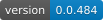

<div align="center">
  
  <h1>N I K A I A</h1>
  <p><strong>Good wins.</strong></p>
  <p>
    Write it like a script. State what must hold with a plain <code>assert</code>: the
    compiler <b>proves</b> what it can, <b>refuses to build</b> what it shows false, and
    checks the rest when the program runs. Where a proof removes a check, the program can
    run <b>faster than the safe Rust you would have written by hand</b>.
  </p>

  <p>
    <a href="#the-idea">The idea</a> •
    <a href="#an-assert-is-a-contract">An assert is a contract</a> •
    <a href="#faster-than-the-rust-you-would-write">Faster than hand-written Rust</a> •
    <a href="#hello-world">Hello, world</a> •
    <a href="#built-in-the-open-at-full-speed">Progress</a> •
    <a href="guide/getting-started.md">Getting started</a> •
    <a href="guide/syntax.md">Syntax tour</a> •
    <a href="manifesto.md">Manifesto</a> •
    <a href="docs/project_status_and_roadmap.md">Status &amp; roadmap</a> •
    <a href="docs/specification">Specification</a> •
    <a href="https://nikaia-lang.org/">Documentation site</a> •
    <a href="https://gemini.google.com/gem/1T8viw7ZHA0TwDZDhr6h1mgRBVnw3aTNP?usp=sharing">Gemini explains Nikaia</a>
  </p>

  
  
  
  
  <a href="https://nikaia-lang.org/"></a>
  <a href="https://github.com/Nikaia-Language/Nikaia"></a>
</div>

---

## The idea

Most programming languages ask you to pick a side.

**Easy languages** like Python or JavaScript let you write what you mean, quickly. You pay
for that later: the program is slower than it could be, it needs more memory and more
machines, and some mistakes only show up in production, under load, at night.

**Fast languages** like C++ or Rust give you the full power of the machine. You pay for that
up front: a large part of every program is not about your problem at all, but about
explaining to the compiler how memory, waiting and sharing should work.

Nikaia starts from a simple observation: **most of that explaining is work a compiler can do
by itself.** When a compiler can see the whole program, it can work out on its own which data
needs protecting, where a function waits for the network, when memory can be freed, and how
to spread work across the cores of a machine. So in Nikaia you write down *what* should
happen, in straight, readable code, and the compiler decides *how*.

That shows up in a few concrete ways:

* **Formal verification that feels like writing `assert`.** There is no proof language, no
  annotation syntax, no `requires` clause. You write `assert(whole > 0)` where you would have
  written it anyway; the compiler proves what it can while it builds, turns it into a contract every
  caller must meet, and **refuses to build** a program it can show breaks it, with the values
  that do. What it cannot prove yet it checks when the program runs, so a claim that is merely
  hard to prove never stops your build.
  [More below](#an-assert-is-a-contract).
* **Safety that makes the program faster, not slower.** The same prover shows that an index
  stays inside its list or a sum inside its type, and then the check is not emitted. On the
  inner loops of an SMT solver, Nikaia's output runs **up to 34 % fewer instructions than the
  same algorithm written by hand in safe Rust**. [The numbers](#faster-than-the-rust-you-would-write).
* **Waiting is not your problem.** A program that reads files or talks to the network is
  written like any other program. There are no special keywords for "this might wait", and
  the program still never sits idle while it waits.
* **Mistakes are caught before the program runs.** Two parts of a program changing the same
  data at the same time, a value that might be missing, an error nobody handles: the compiler
  refuses these, and says in plain words what to write instead.
* **No garbage collector, and no manual memory management.** Memory and files are released at
  a point you can see in the code, without pauses and without writing `free`.
* **One program, small or large machine.** Whether your code uses one core or all of them is
  one line in a configuration file, not a rewrite.
* **Formats are part of the language.** Parsing logs, protocols, or your own little language
  is done by describing the format as a grammar, not by splitting strings by hand.

Nothing here is magic. Nikaia translates your program into Rust, a language whose compiler
already guarantees memory safety, and then lets that compiler do the rest. Nikaia's job is to
make those guarantees available without making you operate them by hand.

The name comes from my daughter, **Nika**. In Persian, *nik* means *good*, and the motto is
the name with a verb: **good wins**. Not over anyone: it means that being kind to the person
writing the code and producing fast programs are not opposites. The whole story, and the
technical case behind every claim above, is in the [**Manifesto**](manifesto.md).

---

## An assert is a contract

Proved where the compiler can, so it costs nothing; refused where the compiler shows it
false, with the values that break it; checked when the program runs everywhere else.

Formal verification usually means a second language: specification clauses, ghost code, loop
invariants and a proof assistant beside the program. Nikaia's answer is the line you already
write.

```nika
fn percent(part: i64, whole: i64) -> i64 {
    assert(whole > 0)              // that is the whole specification
    return part * 100 / whole
}

fn report(done: i64, total: i64) -> i64 {
    return 0 if total <= 0         // this guard proves the claim for this call
    return percent(done, total)
}

fn main() {
    println(f"{report(3, 4)}%")
    println(f"{percent(1, 0)}%")   // and this call breaks it
}
```

`nikaia build --asserts` on exactly this program, which does not build:

```text
asserts in src/main.nika: 1 - proved 0, preconditions 1, checked at run time 0, checked by a test 0, refused 0
  src/main.nika:2  assert(whole > 0)  precondition of `percent`: one call checks it when it runs; any other call proves it or reaches the entry that checks it

error[NK1207]: This call breaks `percent`'s precondition `whole > 0` every time it is reached.
   --> src/main.nika:13:5
    |
 13 |     println(f"{percent(1, 0)}%")
    |     ^^^^^^^^^^^^^^^^^^^^^^^^^^^^
    |
    = note: Here `whole` is 0.
    = help: Pass `percent` arguments for which `whole > 0` holds, or check them with a guard before the call.
1 claim shown false
```

What happened, without a single new keyword:

* **The compiler worked out that `assert(whole > 0)` is a precondition** and made it part of
  `percent`'s contract. Had the claim been about the result, it would have become a
  postcondition. An `assert` further down a function is carried back to the entry through
  every `let`, assignment and branch (weakest preconditions), so you put it where it reads
  best.
* **Every call has to establish it.** `report`'s guard proves it, so that call costs nothing
  at run time. The call with `0` is shown to break it, with the concrete value, and a program
  the compiler has shown wrong does not build: fewer defects reach production. The same holds
  for a value that only some turns of a loop pass (`for i in 0..<10 { percent(1, i) }` is
  refused *when `i` is 0*), and through calls: a function that passes its parameter on hands
  the precondition to its own callers, so the caller that passes the bad value is the one told.
  `refuted-claims = "warn"` in `nikaia.toml` is the bypass for the day a better prover refutes
  code an older one built.
* **The contract crosses package boundaries.** A `pub fn`'s contract is published in its
  package's ledger, a consumer's calls are proved against it, and a change that weakens what
  callers can rely on warns its author.
* **Nothing is refused for being hard to prove.** A claim outside what the prover reads today
  (linear integer arithmetic, lengths, branch conditions) is checked when the program runs,
  and `--asserts` lists it with the reason. Each prover that proves more removes checks and
  changes nothing a correct program does.
* **A proof is not taken on trust.** Every proof comes with a certificate, and a check is
  dropped only when the certificate passes a small checker. Exported as Alethe proofs, all of
  the test suite's proofs are also verified by the independent checker
  [Carcara](https://github.com/ufmg-smite/carcara).

The rules are [ADR-269](docs/specification/adr/adr-269.md); the solver is
[ADR-270](docs/specification/adr/adr-270.md).

---

## Faster than the Rust you would write

Rust checks every `xs[i]` and, in debug builds, every `a + b`, unless LLVM happens to prove
the check away in the code it can see. Removing the rest means `unsafe` and
`get_unchecked`, which nobody wants in application code. Nikaia keeps every check by
default, and with `--optimization=remove-bounds-checks:aggressive` and
`remove-overflow-checks:aggressive` its prover removes each one it can **prove** cannot
fail. Nothing is assumed: a check without a proof stays, at every level, so the program
means exactly the same. Removing is something a build asks for, not the default: a check
removed on a wrong proof would turn a clean stop into a silently wrong result, so the
compiler's proofs have to earn that trust first
([ADR-306](docs/specification/adr/adr-306.md) D14).

Measured on the inner loops of a CDCL(T) solver, against the same algorithms written by hand
in safe Rust, with link-time optimisation on both sides and every program printing the same
checksum. The Nikaia programs keep their overflow checks on; the Rust ones have them on only
where the row says so
([`benches/solver-kernels.nika`](benches/solver-kernels.nika),
[method and tables](docs/solver-workload.md#8-the-solvers-kernels-lowered-from-nikaia)):

| kernel, instructions retired | Rust by hand | Nikaia, checks proved away | |
| :--- | ---: | ---: | ---: |
| big-integer multiplication | 1 088 M | **720 M** | **−34 %** |
| unit propagation over watch lists, overflow checks on in both | 10.69 M | **9.41 M** | **−12 %** |
| sparse-row combination | 966 M | **947 M** | **−2 %** |

And on the [One Billion Row Challenge](benches/brc/README.md), a grammar that describes the
whole file beats the loop a competent Rust programmer writes first, on one core: **0.49 s
against 0.74 s**. A tuned single-core 1BRC entry that skips UTF-8 validation is still faster
(0.22 s); [the benchmark's README](benches/brc/README.md) says why, where the rest goes, and how
it was measured.

The claim is not that Nikaia beats the best Rust a specialist can write with `unsafe`. It is
that the **safe** program you write in Nikaia without thinking about it can beat the safe
program you would write in Rust, because the compiler can prove what Rust's compiler has to
check. The decision is [ADR-306](docs/specification/adr/adr-306.md).

---

## Hello, world

```nika
// src/main.nika
fn main() {
    println("Hello, Nikaia!")
}
```

```sh
nikaia run
```

A slightly bigger taste: read two files **at the same time** and add up their sizes. There is
no `async`, no `await`, no callback and no thread in sight.

```nika
use std::fs

fn size_of(path: ref String) -> i64 throws {
    let text = fs::read_to_string(path, fs::Root::Anywhere)
    return text.len()
}

fn main() throws {
    let (a, b) = overlap {
        size_of("a.txt")
        size_of("b.txt")
    }
    println(f"{a + b} characters in both files")
}
```

**Next:** [Getting started](guide/getting-started.md) installs the compiler and runs your
first project. [A tour of the syntax](guide/syntax.md) shows the whole language on one page,
for readers who come from Python, JavaScript, Go, Java or similar.

---

## Good at, and not good at

**Nikaia is aimed at:**

* **Services that mostly wait**: web APIs, proxies, command-line tools that talk to the
  network. Easy to write like Go or Node.js, without garbage-collection pauses.
* **Data in odd formats**: logs, telemetry, protocol frames, anything you would otherwise
  parse with regular expressions and hope.
* **Heavy computation**: simulations, image and signal processing, aggregating huge inputs,
  with the parallel parts checked by the compiler instead of hoped for.
* **Code written by AI**: when a model writes most of the code, a compiler that refuses races,
  deadlocks and unhandled errors is the reviewer you want
  ([why](manifesto.md), §8).

**Look elsewhere if you need:**

* **An interactive REPL.** This is a design choice, not a gap: Nikaia works out its guarantees
  by looking at the whole program at once, and a line typed into a prompt has no whole program
  around it.

For now, also look elsewhere if you need the things only time brings:

* **Something to ship next quarter.** Nikaia is pre-alpha (see below).
* **A large ecosystem** of libraries.
* **Years of answered questions online.**

---

## Where the project stands

**Pre-alpha.** The compiler builds real programs: the [`examples/`](examples/) directory holds
a calculator, a JSON parser, a log analyser, a small HTTP server, the One Billion Row
Challenge and more, and the test suite compiles and runs all of them except the one that needs
a database. You will also hit
missing pieces quickly: there is no package registry, no formatter or editor
integration yet, and no database access.

The [**status & roadmap**](docs/project_status_and_roadmap.md#where-the-project-actually-stands)
lists what works today, the walls you will hit, and which parts of the design matter most to
test. Bug reports and "this cannot work because…" arguments are very welcome, especially the
latter: an unfinished language is the cheapest place to be told you are wrong.

---

## Built in the open, at full speed

The compiler is moving into Nikaia itself, a module at a time
([ADR-294](docs/specification/adr/adr-294.md)): the analyses that decide sharing, pausing,
lifetimes of views, which statements may overlap and what a function throws are already
Nikaia code that the Rust half of the compiler calls.

| Self-hosted share of the toolchain | Sep 28 | Sep 29 | Sep 30 | Oct 1 | Oct 2 | Oct 3 | Oct 4 |
| :--- | ---: | ---: | ---: | ---: | ---: | ---: | ---: |
| lines of the toolchain written in Nikaia | 2.0 % | 2.4 % | 8.4 % | 10.2 % | 17.6 % | 19.7 % | **30.6 %** |

From the first module on September 28 to 18 625 lines in 61 modules six days later: **about
4.8 percentage points a day**. `scripts/self_hosting.py` recounts it from the sources.

Since Claude Opus started writing the compiler on **September 5, 2026**, with every design
decision argued in an [ADR](docs/specification/adr/README.md) and accepted by a human:

| in 30 days | in all | per day |
| :--- | ---: | ---: |
| commits | 1 233 | **≈ 41** |
| lines of toolchain code (no blanks, no comments) | 541 → 60 959 | **≈ 2 000** |
| change packages, each a [CHANGELOG](CHANGELOG.md) entry, since numbering began on Sep 19 | 0.0.8 → 0.0.454 | **≈ 28** |

*As of 0.0.454, October 4, 2026. Counted from `git log` and `scripts/self_hosting.py`.*

---

## Where to read next

| If you want to… | Read |
| :--- | :--- |
| install the compiler and run a program | [Getting started](guide/getting-started.md) |
| see what the language looks like | [A tour of the syntax](guide/syntax.md) |
| know why the project exists, and how it compares | [Manifesto](manifesto.md) |
| know what works today and what comes next | [Status & roadmap](docs/project_status_and_roadmap.md) |
| see real programs | [examples/](examples/) |
| learn the full rules | [Specification, Part I](docs/specification/10-nikaia-light.md) |
| see the concurrency and parallelism model | [Specification, Part II](docs/specification/20-nikaia-advance.md) |
| understand a design decision | [the ADR index](docs/specification/adr/README.md) |
| let a model write Nikaia for you | [the spec](docs/specification) + [examples/](examples/) in one context |
| work on the compiler | [toolchain architecture](docs/toolchain_architecture.md) |

---

## License

Nikaia is licensed under the Apache License, Version 2.0. See the [LICENSE](LICENSE) file.
On prior art and governance, see the [Manifesto](manifesto.md), §10.

<div align="center">
  <sub>For Nika. For everyone downstream.</sub>
</div>
